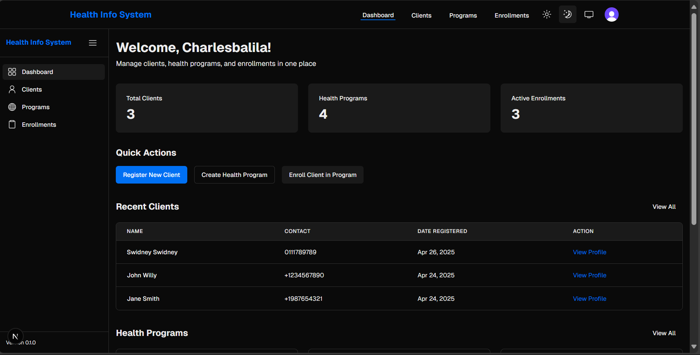
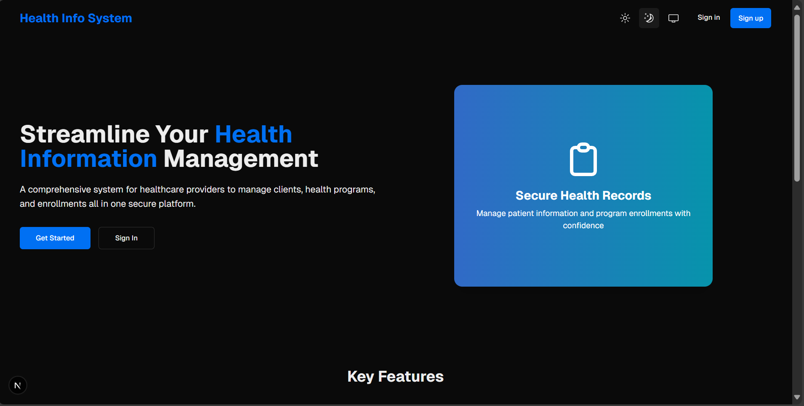

# Health Information System

A comprehensive health information system for managing clients, health programs, and enrollments. This application allows healthcare providers to efficiently manage client registrations, health programs, and track client enrollments in various health initiatives.

## Screenshot





## Features

- **Dashboard**: Overview of key metrics and quick access to most-used functions
- **Client Management**: Register, view, update, and delete client records
- **Health Programs**: Create and manage health programs (TB, Malaria, HIV, etc.)
- **Enrollment Management**: Enroll clients in multiple health programs
- **Search**: Easily find clients by name, email, or phone number
- **RESTful API**: Access client and program data programmatically via API endpoints

## Technology Stack

- **Frontend**: Next.js 15, React 19, TypeScript, Tailwind CSS
- **State Management**: Zustand (with client-side persistence)
- **Form Handling**: React Hook Form with Zod validation
- **UI Components**: Custom components built with Radix UI primitives
- **API**: RESTful API built with Next.js API routes

## Getting Started

### Prerequisites

- Node.js 18.0 or higher
- npm or yarn

### Installation

1. Clone the repository:
   ```
   git clone https://github.com/Dau6/health-information-system.git
   cd health-information-system
   ```

2. Install dependencies:
   ```
   npm install
   # or
   yarn install
   ```

3. Run the development server:
   ```
   npm run dev
   # or
   yarn dev
   ```

4. Open your browser and navigate to `http://localhost:3000`


## API Documentation

### Clients API

- `GET /api/clients` - Get all clients or search by query parameter
- `POST /api/clients` - Create a new client
- `GET /api/clients/:id` - Get client details with enrolled programs
- `PUT /api/clients/:id` - Update a client
- `DELETE /api/clients/:id` - Delete a client

### Programs API

- `GET /api/programs` - Get all health programs
- `POST /api/programs` - Create a new health program
- `GET /api/programs/:id` - Get program details with enrolled clients
- `PUT /api/programs/:id` - Update a health program
- `DELETE /api/programs/:id` - Delete a health program

### Enrollments API

- `GET /api/enrollments` - Get all enrollments
- `POST /api/enrollments` - Create a new enrollment
- `GET /api/enrollments/:id` - Get enrollment details
- `PUT /api/enrollments/:id` - Update an enrollment
- `DELETE /api/enrollments/:id` - Withdraw a client from a program

## Data Security Considerations

- Client-side data validation using Zod
- Server-side validation of all API requests
- No sensitive health information is stored in client-side storage
- Data validation and sanitization at all entry points

## License

This project is licensed under the MIT License - see the LICENSE file for details.


